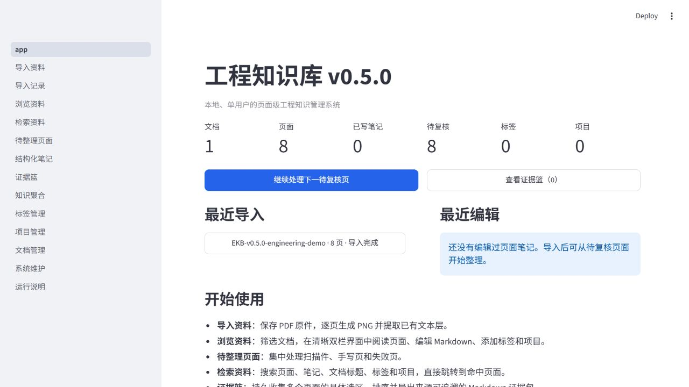

[English](README_EN.md) | [简体中文](README.md)

# Engineering Knowledge Base

Engineering Knowledge Base (EKB) is a local-first, single-user knowledge management system for engineering documents on Windows. It turns PDFs that you choose to import into page-level assets that can be read, reviewed, searched, traced to their source, and reused:

**Document → Understanding → Retrieval → Evidence → Reuse → Engineering Capability**

EKB is not a generic AI chatbot, a cloud document service, or an automatic PDF summarizer. Local files and SQLite remain the source of truth. Core document management and lexical search work offline, without an account, API key, VPN, or cloud dependency. Optional AI-assisted retrieval must be explicitly configured and invoked.



> The existing screenshots were captured from the v0.5.0 interface using isolated, original demonstration material. They do not contain production, staging, customer, or private data. v0.5.1 retains this product foundation and adds retrieval-coverage and weak-evidence status text.

## Current Release

**v0.5.1 — Retrieval Stabilization** makes embedding coverage visible and adds an honest weak-evidence notice without changing the underlying retrieval ranking behavior.

- Embedding coverage is reported from locally persisted page embeddings. Index completion remains an explicit, manual operation.
- Hybrid results can warn when every returned item has lexical evidence only; this is not a numerical relevance guarantee.
- A frozen benchmark and repeatable evaluation workflow now cover lexical, vector, and hybrid behavior. Real-embedding calibration evidence is retained instead of being converted into an unsupported similarity threshold.
- Hybrid fallback states are explicit, so keyword fallback is distinguishable from a successful vector path.
- The final hybrid result count remains a deferred product decision and is not presented as bounded in this release.

The production path still unions lexical and vector candidates using equal-weight reciprocal rank fusion (RRF). v0.5.1 does not add a production `vector_weight`, a separate vector `top_k`, or a numerical similarity eligibility threshold.

Retrieval quality is still an open engineering problem. v0.5.1 partially mitigates known coverage and weak-evidence issues; it does not claim that semantic retrieval is complete or universally reliable. See the [v0.5.1 release](https://github.com/JZ-05T68/engineering-knowledge-base-src/releases/tag/v0.5.1) and the [final validation record](docs/v0.5.1-phase7-final-validation.md).

## What EKB Solves

Engineering knowledge is often buried in long datasheets, manuals, standards, and project notes. Finding a promising page is only part of the job: the result must still be checked against the original document and retained with enough context to be useful later.

EKB provides a local workflow for that loop:

1. Import a PDF while preserving the original file.
2. Render every page to PNG and extract an existing text layer.
3. Flag scanned, handwritten, or otherwise uncertain pages for review; run local, single-page OCR when appropriate.
4. Add page Markdown, structured notes, tags, and projects.
5. Search locally with SQLite FTS5 and trace each result back to its document, filename, page number, and source image.
6. Collect whole pages, text selections, or image regions as evidence and confirm them manually.
7. Generate a citation-grounded prompt package for manual use with an external AI tool.

The prompt-package step does not send documents to an external service. Source validity is checked again before generation, and invalid evidence fails closed.

## Current Capabilities

- SHA-256 duplicate detection, page-by-page PNG rendering, text-layer extraction, and isolated page-failure handling.
- Local single-page OCR for printed text; OCR output is treated as an unverified draft and does not overwrite the source PDF, page image, or manual notes.
- Page reading and review, Markdown editing, structured notes, tags, projects, document management, and cross-document aggregation.
- Offline lexical retrieval with SQLite FTS5, jieba tokenization, filters, sorting, highlighting, and navigation back to the source page.
- Optional page-level embedding persistence and hybrid lexical/vector retrieval with explicit mode selection, local freshness checks, provenance labels, and keyword fallback.
- Evidence objects for pages, text selections, and image regions, with confirmed/unconfirmed boundaries and source-integrity validation.
- Local backup, restore preflight, diagnostics, and production/staging data isolation.

EKB does not perform automatic large-language-model question answering, web search, unattended indexing of private material, handwritten/formula/table OCR, or cloud synchronization. Runtime reranking and chunk-level indexing are not current capabilities.

## Evidence and Traceability

The core retrieval path is designed around verification:

```text
PDF → page → retrieval result → source check → evidence basket
    → human confirmation → citation-grounded prompt package
```

Every reusable item retains its source context. Original PDFs and rendered page images are never automatically overwritten or deleted. EKB processes only material that the user actively imports or explicitly authorizes.

## Technology Stack

- Python 3.11 and Streamlit
- SQLite with FTS5
- PyMuPDF and Pillow
- RapidOCR and ONNX Runtime for local OCR
- pydantic-settings and python-dotenv
- jieba and rapidfuzz
- pytest and Ruff

The application binds to `127.0.0.1:8501` by default. It has no registration, login, user-account, role, OAuth, JWT, or cloud-sync subsystem.

## Installation

Requirements:

- Windows 10 or 11 with PowerShell
- Python 3.11
- Python's SQLite build with FTS5 support

From the repository root:

```powershell
py -3.11 -m venv .venv
.\.venv\Scripts\Activate.ps1
python -m pip install --upgrade pip
python -m pip install -r requirements.txt
```

Optionally create a local configuration file from the provided example:

```powershell
Copy-Item .env.example .env
```

For a complete clean-machine procedure, see [Windows recovery and environment reconstruction](docs/windows-recovery.md). GitHub restores the software and configuration instructions, not your `.env`, database, imported documents, logs, or cache.

## Start and Stop

For normal use, double-click `启动工程知识库.bat`. It validates the virtual environment, process state, health endpoint, and port, then starts EKB in the background and opens <http://127.0.0.1:8501>.

Use `停止工程知识库.bat` to stop the validated EKB process and `查看运行状态.bat` to inspect its state. For foreground development:

```powershell
.\.venv\Scripts\python.exe -m streamlit run app.py
```

Do not change the production bind address to `0.0.0.0` or expose the service to a LAN or the public internet.

## Repository Layout

| Path | Purpose |
|---|---|
| `app.py` | Streamlit entry point and home dashboard |
| `pages/` | Import, reader, retrieval, review, organization, maintenance, and evidence UI |
| `src/` | Application services, data access, migrations, retrieval, evidence, backup, and diagnostics |
| `scripts/` | Service management, restore, release checks, and controlled evaluation utilities |
| `tests/` | Automated test suite |
| `benchmarks/` | Frozen retrieval evaluation fixtures and supporting material |
| `docs/` | Release records, validation evidence, recovery instructions, and engineering decisions |
| `data/` | Local production originals, rendered pages, Markdown, and SQLite data; ignored by Git |
| `staging-data/` | Isolated staging data used for controlled validation; ignored by Git |

User data, credentials, logs, runtime files, and backups are kept outside version control. Production uses `data/` on port 8501; controlled staging uses `staging-data/` on port 8502.

## Development Checks

```powershell
python -m ruff check .
python -m pytest
```

README-only changes do not require rerunning the complete product test suite. The v0.5.1 release baseline recorded 1,475 passing tests, a successful production rollout on `127.0.0.1:8501`, and zero rollout regressions. Release-specific evidence and remaining limitations are recorded in the linked release and validation documents.

## Documentation and Links

- [Releases](https://github.com/JZ-05T68/engineering-knowledge-base-src/releases)
- [Changelog](CHANGELOG.md)
- [Windows recovery](docs/windows-recovery.md)
- [Repository maintenance rules](docs/repository-maintenance.md)
- [Public product showcase](https://github.com/JZ-05T68/engineering-knowledge-base)

`README.md` and `README_EN.md` are maintained together as official project documentation. Release, capability, positioning, and presentation changes should update both languages. Japanese and Korean documentation is deferred to v1.2; no placeholder files are provided in this release.
